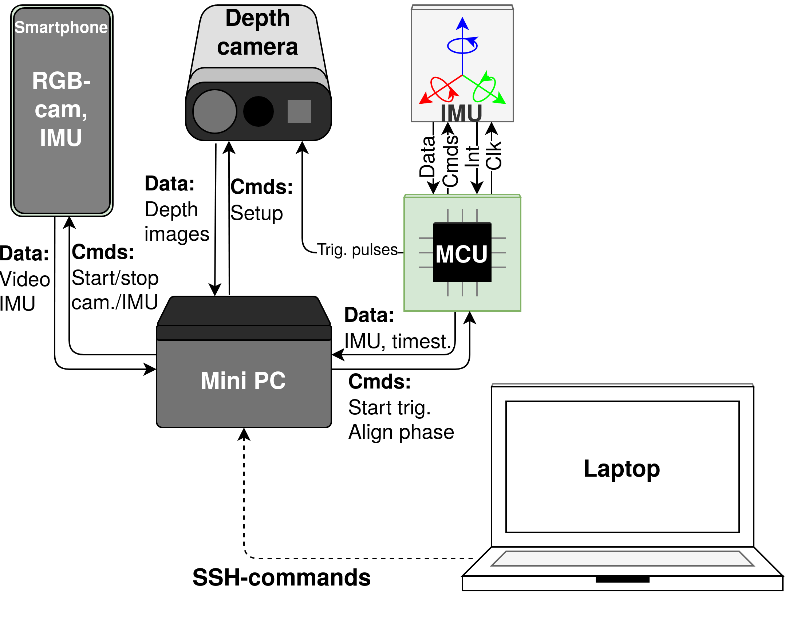

# SmartDepthSync: Open Source Synchronized Video Recording System of Smartphone RGB and Depth Camera Range Image Frames with Sub-millisecond Precision

<p align="center">
  
</p>

This is a repository that gathers open-source materials introduced and described in the SmartDepthSync paper ([IEEE link](https://ieeexplore.ieee.org/document/9709778/),
[arXiv link](https://arxiv.org/abs/2111.03552)). In addition to the paper, some description can be found in the links in the table below. The table keeps all the important link to the building parts of the system depicted in the image.  

The materials represent diverse software and their own functionality launched on different hardware:
<table>
    <tr> <td>Material</td> <td>Function</td> <td>Launched on</td> </tr>
    <tr> <td> <a href="https://github.com/Marselka/bandeja-wrapper">Python launcher</a> </td> <td>command-line tool that is entry point for setup (launch of sensors, synchronization) and recording to ROS bag file procedures</td> <td> mini-PC </td> </tr>
    <tr> <td> <a href="https://github.com/Marselka/bandeja-ros-src/">ROS source code</a> </td> <td>driver for setting up and gathering data from the sensors (Azure Kinect DK depth camera and MCU board with IMU sensor)</td> <td>mini-PC</td> </tr>
    <tr> <td> <a href="https://github.com/Marselka/bandeja-mcu-firmware/">MCU firmware</a> </td> <td>responsible for synchronized depth camera triggering and IMU data gathering</td> <td>MCU board</td> </tr>
    <tr> <td> <a href="https://github.com/MobileRoboticsSkoltech/OpenCamera-Sensors">OpenCamera-Sensors</a> </td> <td>smartphone application that records RGB video data and provides timestamps for synchronized depth camera triggering.  </td> <td>smartphone</td> </tr>
    <tr> <td> <a href="https://github.com/MobileRoboticsSkoltech/bag-extractor">bag-extractor</a> </td> <td>CLI-script that extracts recorded ROS bag files to images and other data types distributed to paths</td> <td>any PC</td> </tr>
</table>

For entire clone with submodules:
```
git clone --recurse-submodules https://github.com/MobileRoboticsSkoltech/bandeja-platform
```

## Twist-n-Sync Python Package
Synchronization is based on our [Twist-n-Sync](https://github.com/MobileRoboticsSkoltech/twistnsync-python) algorithm that can be installed via `pip`.

Using this materials please do not forget to reference this repository and cite the paper:

```
@ARTICLE{9709778,
  author={Faizullin, Marsel and Kornilova, Anastasiia and Akhmetyanov, Azat and Pakulev, Konstantin and Sadkov, Andrey and Ferrer, Gonzalo},
  journal={IEEE Sensors Journal}, 
  title={SmartDepthSync: Open Source Synchronized Video Recording System of Smartphone RGB and Depth Camera Range Image Frames With Sub-Millisecond Precision}, 
  year={2022},
  volume={22},
  number={7},
  pages={7043-7052},
  doi={10.1109/JSEN.2022.3150973}
}
```
